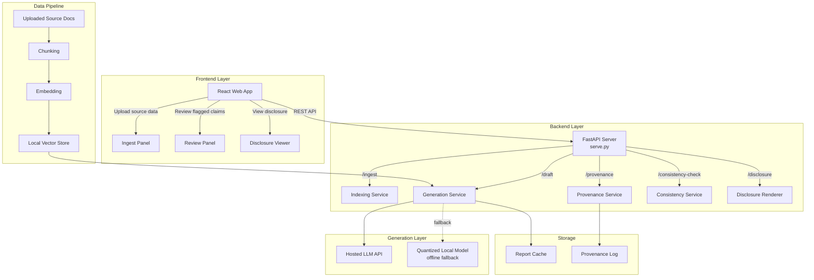

# Aiga — AI Reporting Assistant with Provenance & Disclosure

Help resource-constrained NGOs adopt AI for report drafting without sacrificing accuracy, originality, or trust — every AI-generated claim is automatically traced to its source and disclosed to donors and communities alike.

*2026 Humanitarian Innovation Hackathon — Challenge A: Supporting the adoption of AI across non-governmental organisations (NGOs)*

---

## Features
 
- **Source-Grounded Drafting**: Retrieval-augmented generation (RAG) restricts the model to ingested source material only.
- **Automatic Provenance Tracking**: Every generated claim is mapped to the exact source chunk it came from
- **Consistency Checking**: Rules-based numeric matching plus a lightweight classifier flags claims that don't match their tagged source 
- **Dual Disclosure Rendering**: Separate donor (full citation) and community (plain-language) views generated from the same underlying provenance data
- **Offline-First**: Quantized local model as an automatic fallback when hosted API access is unavailable
- **REST API**: FastAPI-based backend for ingestion, drafting, provenance lookup, consistency checks, and disclosure rendering
- **Modular Architecture**: Clean separation of ingestion, generation, provenance, consistency checking, and disclosure rendering

## Quick Start

### Backend

```bash
cd backend
python -m venv .venv
.\.venv\Scripts\activate
pip install -r requirements.txt

# Start API server
python -m uvicorn serve:app --host 127.0.0.1 --port 8000 --reload
```

- Backend Swagger UI: `http://127.0.0.1:8000/docs`

**Optional: seed local vector store & offline model cache**
```bash
# (Optional) Chunk + embed sample source documents for RAG retrieval
python data_pipeline/build_index.py

# (Optional) Download and cache the quantized offline fallback model
python scripts/fetch_offline_model.py
```

### Frontend

```bash
cd frontend
npm install
npm start
```

Frontend URL: `http://127.0.0.1:3000`
The frontend expects the backend at `http://127.0.0.1:8000`.

### Testing

```bash
cd backend
pytest -q
```

**Test coverage:**
- **Unit tests** — provenance tagger, consistency checker (`test_provenance.py`, `test_consistency.py`)
- **API tests** — all endpoints via TestClient (`test_api.py`)
- **Integration tests** — end-to-end draft → tag → check → disclose workflow
- **Error handling** — 422, 404, 400, 500 status codes
- **Data validation** — empty/malformed source documents, unsupported file types

---
## Requirements
 
- Python 3.10+
- Node.js 18+ (frontend)
- fastapi
- uvicorn
- sentence-transformers *(or equivalent embedding library for the local vector store)*
- scikit-learn *(consistency-check classifier)*
- pandas
- pydantic
- pytest
See `backend/requirements.txt` for pinned versions *(planned)*.
 
---


## API Endpoints *(planned)*

| # | Method | Endpoint | Description |
|---|--------|----------|-------------|
| 1 | `GET` | `/health` | Health check endpoint |
| 2 | `POST` | `/ingest` | Upload source material (field notes, survey CSV, raw text) for a report |
| 3 | `POST` | `/draft/{source_id}` | Generate a draft report from ingested source material |
| 4 | `GET` | `/provenance/{report_id}` | Retrieve source-mapping for every claim in a draft |
| 5 | `POST` | `/consistency-check/{report_id}` | Run the source-consistency check and return flagged claims |
| 6 | `GET` | `/disclosure/{report_id}` | Return the rendered donor and community disclosure versions |

### 1. `GET /health`
**Response (200 OK):**
```json
{ "status": "ok" }
```

### 2. `POST /ingest`
**Description:** Accepts source material for a report. Text and CSV supported; documents are chunked and embedded for retrieval.
**Request Body (multipart/form-data):**
- `file` — source document (`.txt`, `.csv`, `.md`)
- `program_name` — string label for the report context

**Response (200 OK):**
```json
{
  "source_id": "src_0142",
  "chunks_indexed": 18
}
```
**Error Responses:**
- `400 Bad Request` — unsupported file type
- `422 Unprocessable Entity` — empty or unreadable file

### 3. `POST /draft/{source_id}`
**Description:** Generates a draft report using only the ingested source material (retrieval-augmented generation — the model is restricted to cited chunks).
**Request Body (application/json):**
```json
{
  "report_type": "donor_quarterly",
  "audience": "donor"
}
```
**Response (200 OK):**
```json
{
  "report_id": "rpt_0091",
  "draft_text": "...",
  "spans": [
    { "span_id": "s1", "text": "500 households received relief kits", "source_chunk": "src_0142#c4" }
  ]
}
```
**Error Responses:**
- `404 Not Found` — `source_id` does not exist
- `500 Internal Server Error` — generation service unavailable (falls back to offline model automatically; error only surfaces if both fail)

### 4. `GET /provenance/{report_id}`
**Description:** Returns the full span-to-source mapping for a generated report.
**Response (200 OK):**
```json
{
  "report_id": "rpt_0091",
  "provenance": [
    { "span_id": "s1", "source_chunk": "src_0142#c4", "source_excerpt_ref": "field_survey_march.csv, row 12" }
  ]
}
```

### 5. `POST /consistency-check/{report_id}`
**Description:** Cross-checks numeric and factual claims in the report against their tagged source. Rules-based numeric matching plus a lightweight classifier for textual consistency — not a second generative model.
**Response (200 OK):**
```json
{
  "report_id": "rpt_0091",
  "flags": [
    { "span_id": "s3", "issue": "numeric_mismatch", "claim": "620 households", "source_value": "500 households" }
  ],
  "flag_count": 1
}
```
**Error Responses:**
- `404 Not Found` — `report_id` does not exist

### 6. `GET /disclosure/{report_id}`
**Description:** Returns both disclosure renderings for the finished report.
**Response (200 OK):**
```json
{
  "donor_version": { "format": "html", "citations_inline": true },
  "community_version": { "format": "plain_text", "summary": "This report was partly written with AI assistance, based on the March field survey." }
}
```

---

## Architecture



**Components:**
- **Frontend (React, `frontend/`)** — upload source material, review flagged claims, preview donor and community disclosure views. Talks to the backend via REST.
- **Backend (Python/FastAPI, `backend/`)** — ingestion, retrieval-augmented drafting, provenance tracking, consistency checking, disclosure rendering.
- **Generation layer** — hosted LLM API for online use; quantized local model as an automatic offline fallback for low-connectivity field settings.
- **Provenance service** — metadata pipeline, not a model. Every generated span is mapped to the retrieved source chunk that produced it.
- **Consistency service** — narrow, rules-based/small-classifier checks against tagged source data. Deliberately not a second LLM checking the first.
- **Storage** — local-first; reports and provenance logs sync to donor/cloud storage only at export time.

---

## Code Structure *(planned)*

### Frontend (`frontend/`)
```
frontend/
├── public/
│   └── assets/                    # Icons, demo media
├── src/
│   ├── components/
│   │   ├── ingest/                 # Source upload UI
│   │   ├── review/                 # Flagged-claim review UI
│   │   └── disclosure/             # Donor / community disclosure views
│   ├── pages/
│   │   ├── Home.jsx
│   │   ├── Ingest.jsx
│   │   ├── Review.jsx
│   │   └── Disclosure.jsx
│   ├── api/
│   │   └── client.js               # Backend communication
│   ├── App.js
│   └── index.js
└── package.json
```

### Backend (`backend/`)
```
backend/
├── serve.py                       # FastAPI application entry point
├── config.py                      # Configuration (online/offline model routing)
├── requirements.txt
├── services/
│   ├── indexing.py                # Chunk + embed source documents
│   ├── generation.py              # RAG drafting (online + offline fallback)
│   ├── provenance.py              # Span-to-source mapping
│   ├── consistency.py             # Rules-based / classifier consistency checks
│   └── disclosure.py              # Donor + community disclosure rendering
├── schemas/
│   ├── ingest.py
│   ├── draft.py
│   └── disclosure.py
├── data_pipeline/
│   └── build_index.py             # Vector store construction
├── storage/
│   ├── reports/                   # Cached generated reports
│   └── provenance_logs/
├── tests/
│   ├── conftest.py
│   ├── test_provenance.py
│   ├── test_consistency.py
│   └── test_api.py
└── README.md
```

---
## Data Format
 
### Input Data
Source material accepted via `POST /ingest`:
- `.txt` / `.md` — free-text field notes, narrative program updates
- `.csv` — structured survey or program data (e.g. households reached, distribution logs)
Internally, ingested material is chunked and embedded into a local vector store (no external upload of raw community data required for the embedding step itself).
 
### Report / Provenance Output
Each generated report (`draft_text`) is accompanied by a `spans` array mapping every claim to a `source_chunk` reference, and a `provenance` record resolving each `source_chunk` back to a human-readable source excerpt (e.g. `field_survey_march.csv, row 12`).
 
---

## Output Files *(planned)*
 
The pipeline is designed to produce, per report:
 
1. **Draft report** (`storage/reports/{report_id}.json`) — generated text plus span-level metadata
2. **Provenance log** (`storage/provenance_logs/{report_id}.json`) — full source mapping for every claim
3. **Consistency flags** (returned by `/consistency-check`, cached alongside the report) — flagged claims with the mismatched source value
4. **Donor disclosure export** (`.html`) — full citation view for donor submission
5. **Community disclosure export** (`.txt` / rendered in-app) — plain-language AI-use summary
### Consistency-checker evaluation *(planned, to be run against a labelled validation set before deployment)*
 
| Metric | Purpose |
|---|---|
| Precision / Recall on flagged claims | How often a real mismatch is caught vs. missed |
| False positive rate | How often correct claims are wrongly flagged, which erodes staff trust in the tool |
 
This mirrors standard classifier evaluation practice — the consistency checker should be benchmarked against a small hand-labelled set of known-good and known-mismatched claims before relying on it in the field, rather than assumed to work out of the box.
 
### Reports glossary
- `evaluation_reports/consistency_eval_summary.csv` — precision/recall/false-positive rate for the consistency checker against the labelled validation set
- `evaluation_reports/flag_distribution.png` — breakdown of flagged-claim types (numeric mismatch, unsupported claim, etc.) across test reports

---


## Input Validation & Error Handling *(planned)*

**Frontend**
- Real-time validation on source upload (file type, non-empty check)
- Flagged claims clearly separated from unflagged content in the review panel
- Report generation disabled until source material is successfully ingested

**Backend**
- File type restricted to supported formats (`.txt`, `.csv`)
- Consistency check runs automatically before a report can be marked ready for disclosure
- Clear error messages with appropriate HTTP status codes (422, 404, 400, 500)

---

## Troubleshooting

### Offline fallback not triggering
- Confirm the quantized local model has been downloaded (`scripts/fetch_offline_model.py`)
- Check `config.py` for the online→offline failover threshold/timeout setting

### Consistency check returns no flags on obviously mismatched data
- Ensure the source document was successfully indexed (`GET /ingest` response should show `chunks_indexed > 0`)
- Rules-based numeric matching requires consistent units/formatting between draft and source — mismatched formatting (e.g. "500" vs "five hundred") is a known edge case

---

## Alignment

**Humanitarian Engineering principles:** Effective (safeguard tied directly to the adoption mechanism) · Resources considered (no dedicated AI team required, offline-capable) · Appropriate (disclosure format flagged for community validation) · Sustainable (local-first, reduces API dependency) · Do no harm (provenance + consistency checks reduce misrepresentation risk; humans stay in the loop)

**SDGs:** 
9 (Industry, Innovation and Infrastructure)  
16 (Peace, Justice and Strong Institutions)
17 (Partnerships for the Goals)

---