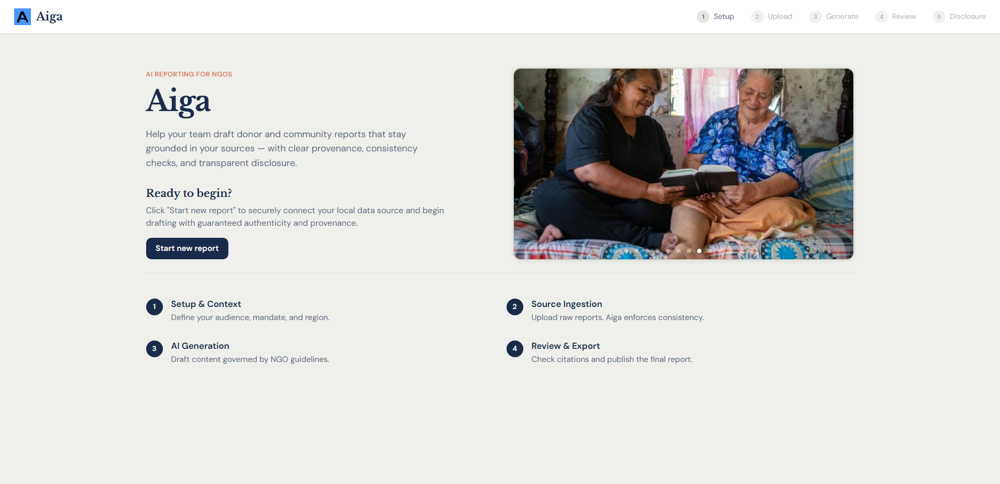
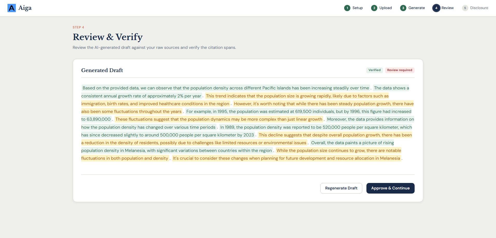
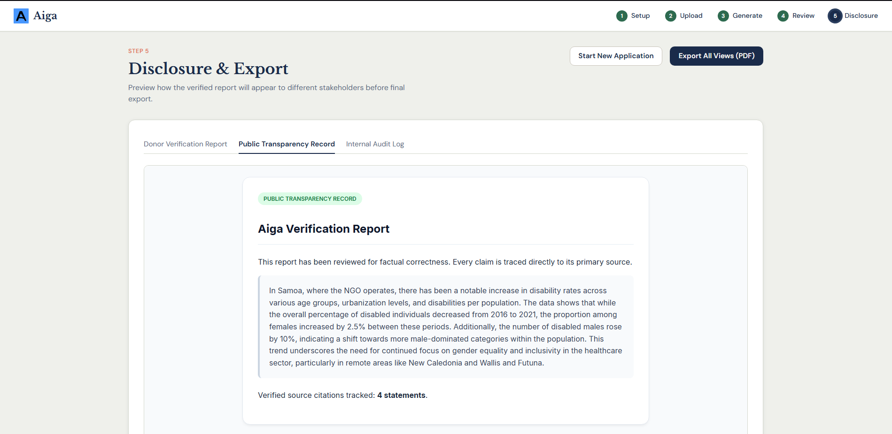

# Aiga — AI Reporting Assistant with Provenance & Disclosure

Help resource-constrained NGOs adopt AI for report drafting without sacrificing accuracy, originality, or trust — every AI-generated claim is automatically traced to its source, scored for semantic accuracy, and disclosed to donors and communities alike.

*2026 Humanitarian Innovation Hackathon — Challenge A: Supporting the adoption of AI across non-governmental organisations (NGOs)*

---

## Live Demo
https://2026-humanitarian-innovation-hac-git-adb2c6-schnitze1s-projects.vercel.app





---

## Features
 
- **Source-Grounded Drafting**: Retrieval-augmented generation (RAG) restricts the model to ingested source material only.
- **Automatic Provenance Tracking**: Every generated claim is mapped to the exact source chunk it came from.
- **Semantic Alignment Scoring**: Replaced binary consistency checks with a robust 0-100% semantic accuracy score utilizing cosine similarity embeddings, visualized dynamically (green for high confidence, orange for low confidence).
- **Tailored NGO Profiles & Guidelines**: Persistent PostgreSQL database stores client guidelines injected directly into the LLM Transformer model's system prompt.
- **Contextual South Pacific Imagery**: Dynamic integration with LoremFlickr pull localized photography from South Pacific nations (Fiji, Samoa, Vanuatu, Tonga) aligned to 14 specific NGO issues.
- **Triple Disclosure Rendering**: Native HTML iframes generated by the backend for Donor (full citation), Public (plain-language), and Internal (audit) views. 
- **Native PDF Export**: Utilize the browser's built-in print engine to stitch and seamlessly "Save as PDF" the entire disclosure audit package.
- **Cross-Device Compatibility**: Fully responsive React UI optimized for seamless usage on desktop, iPad, and mobile devices.

## Quick Start

### Backend

```bash
# 1. Start the PostgreSQL Database (requires Docker)
docker-compose up -d

# 2. Setup the Python environment
cd backend

# On Windows:
python -m venv .venv
.\.venv\Scripts\activate

# On Mac/Linux:
python3 -m venv .venv
source .venv/bin/activate

pip install -r requirements.txt

# 3. Start API server
python serve.py 
```

- Backend Swagger UI: `http://127.0.0.1:8000/docs`

### Frontend

```bash
cd frontend
npm install
npm start
```

Frontend URL: `http://127.0.0.1:3000`
The frontend expects the backend at `http://127.0.0.1:8000`.

---
## Requirements
 
- Python 3.10+
- Docker (for PostgreSQL database)
- Node.js 18+ (frontend)
- fastapi, uvicorn, pydantic
- sentence-transformers (for semantic accuracy alignment scoring)
- pandas, pytest
 
---

## API Endpoints

| # | Method | Endpoint | Description |
|---|--------|----------|-------------|
| 1 | `GET` | `/health` | Health check endpoint |
| 2 | `GET` | `/api/clients` | List all registered NGO client profiles |
| 3 | `POST` | `/api/clients` | Create a new NGO client profile |
| 4 | `POST` | `/api/ingest` | Upload source material (field notes, survey CSV, raw text) for a report |
| 5 | `POST` | `/api/draft/{source_id}` | Generate a draft report and calculate semantic accuracy spans |
| 6 | `GET` | `/api/provenance/{report_id}` | Retrieve source-mapping for every claim in a draft |
| 7 | `GET` | `/api/disclosure/{report_id}` | Return the HTML rendered donor, public, and internal disclosure versions |

---

## Architecture

**Components:**
- **Frontend (React)** — User-friendly 5-step workflow with a persistent global progress bar, utilizing a custom API client. 
- **Backend (Python/FastAPI)** — Ingestion, retrieval-augmented drafting, accuracy scoring, disclosure rendering.
- **Database (PostgreSQL)** — Securely stores NGO client profiles and custom operational guidelines.
- **Accuracy Engine** — Uses sentence-transformers to calculate cosine similarity between the generated claim and the retrieved source text, ensuring hallucinatory facts are visually flagged before export.
- **Disclosure Export** — Stitches backend-rendered HTML templates via iframe for isolated styling and uses native browser printing for PDF creation.

---

## CI/CD Pipeline (DagsHub & DVC)

The project utilizes an automated MLOps pipeline configured via GitHub Actions.
1. **Trigger:** Runs whenever new raw data is pushed or DVC config changes.
2. **Data Pull:** Authenticates via WebDAV to DagsHub.
3. **Re-Indexing:** Runs `dvc repro rebuild_index` to chunk and embed newly uploaded data.
4. **Auto-Commit:** The rebuilt indexes are pushed back to DagsHub, and the bot auto-commits the updated `dvc.lock`.

---

## Alignment

**Humanitarian Engineering principles:** Effective (accuracy scores immediately highlight hallucinations) · Resources considered (runs entirely locally, offline capable) · Appropriate (disclosure formats tailored to specific audiences) · Sustainable (reduces dependency on external cloud services).

**SDGs:** 
9 (Industry, Innovation and Infrastructure), 16 (Peace, Justice and Strong Institutions), 17 (Partnerships for the Goals)